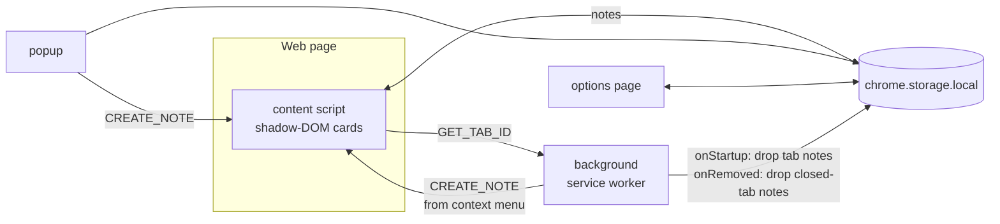

# Anchored Notes


A Chrome (Manifest V3) extension for leaving sticky notes on web pages. Each note
is **anchored** to one of four scopes and reappears wherever that scope matches.

| Scope    | Shows on                                            |
| -------- | --------------------------------------------------- |
| `global` | every open page                                     |
| `site`   | every page of the note's origin (e.g. `google.com`) |
| `page`   | the exact URL (origin + path + query, hash ignored) |
| `tab`    | that tab, even after navigation; lost on restart    |

Notes are draggable, resizable, recolorable (7 colors), and the scope can be
changed at any time from the dropdown on the note header. When the page exposes a
PWA `manifest.json` with `short_name` or `name`, the **Site** scope option shows
that app name; otherwise it falls back to the short domain (e.g. `bbc.com` from
`www.bbc.com`). The **Page** scope shows the current `document.title` when available.
[Milkdown](https://github.com/Milkdown/milkdown) markdown WYSIWYG editor
(commonmark + GFM presets, themeless), so `note.content` is stored as markdown
text — backward compatible with earlier plaintext notes. It supports a
Notion-style `/` slash menu for inserting blocks (headings, lists, task lists,
quote, code, tables, divider), GFM task lists with clickable checkboxes, and
resizable tables with a floating toolbar (add/remove rows and columns, delete
table). Markdown-aware paste parses pasted markdown into formatted content
rather than keeping it as raw text.

## Architecture



- **Storage:** all notes live under one `notes` key in `chrome.storage.local`.
  Tab-scoped notes are dropped on `onStartup` (previous tab ids are meaningless)
  and on tab close, making them effectively session-only.
- **Visibility** is decided by the pure `isNoteVisible` function in
  `src/matching.ts`, shared by the content script, popup and options page.
- **Localization:** `src/i18n.ts` is a small runtime i18n layer (English +
  Turkish). The active language is stored under the `lang` key in
  `chrome.storage.local`, defaulting to the detected system language. Switching
  it from the popup's flag picker updates every context live (popup, options,
  on-page note cards, slash/table menus and the context menu) via a storage
  change listener. Per-language strings live in `src/locales/<lang>.ts`; English
  is canonical and its keys define the `MessageKey` type, so any missing
  translation is a compile-time error.

## Develop

```bash
npm install
npm run build      # generates icon + bundles into dist/
npm test           # unit tests for matching logic
npm run typecheck
```

Then load `dist/` via `chrome://extensions` → Developer mode → **Load unpacked**.

## Usage

- Right-click a page → **Add Note Here**, or click the toolbar icon → **Add note
  to this page**.
- Drag by the header, resize from the bottom-right corner, pick a color with the
  🎨 button, change the anchor scope with the dropdown. The ⋮ button opens an
  options menu to **Hide** or **Delete** the note.
- Hiding collapses a note into a badge in the bottom-right corner of the page
  showing the count of hidden notes; click the badge to pick one and restore it.
  The badge stays out of sight while no note on the page is hidden.
- Manage, search, export and import all notes from the options page. Each row
  shows the note's auto-derived title (its first markdown block); click a row to
  expand its full content inline.
- Switch the interface language (English / Türkçe) from the small flag button in
  the top-right of the popup. The default follows your system language.
