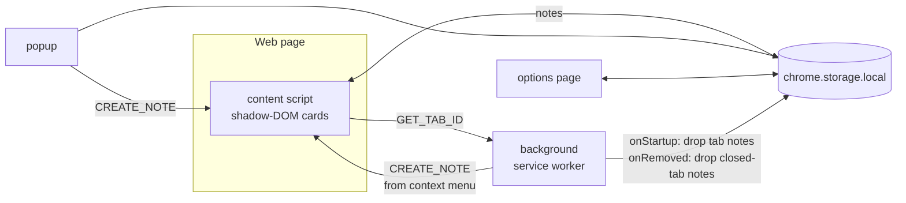

# Anchored Notes

A Chrome (Manifest V3) extension for leaving sticky notes on web pages. Each note
is **anchored** to one of four scopes and reappears wherever that scope matches.

| Scope    | Shows on                                            |
| -------- | --------------------------------------------------- |
| `global` | every open page                                     |
| `site`   | every page of the note's origin (e.g. `google.com`) |
| `page`   | the exact URL (origin + path + query, hash ignored) |
| `tab`    | that tab, even after navigation; lost on restart    |

Notes are draggable, resizable, recolorable (7 colors), and the scope can be
changed at any time from the dropdown on the note header. The note body is a
[Milkdown](https://github.com/Milkdown/milkdown) markdown WYSIWYG editor
(commonmark preset, themeless), so `note.content` is stored as markdown text —
backward compatible with earlier plaintext notes. It supports a Notion-style
`/` slash menu for inserting blocks (headings, lists, quote, code, divider) and
markdown-aware paste — pasted markdown is parsed into formatted content rather
than kept as raw text.

## Architecture



- **Storage:** all notes live under one `notes` key in `chrome.storage.local`.
  Tab-scoped notes are dropped on `onStartup` (previous tab ids are meaningless)
  and on tab close, making them effectively session-only.
- **Visibility** is decided by the pure `isNoteVisible` function in
  `src/matching.ts`, shared by the content script, popup and options page.

## Develop

```bash
npm install
npm run build      # generates icon + bundles into dist/
npm test           # unit tests for matching logic
npm run typecheck
```

Then load `dist/` via `chrome://extensions` → Developer mode → **Load unpacked**.

## Usage

- Right-click a page → **Add Note Here**, or click the toolbar icon → **Add note
  to this page**.
- Drag by the header, resize from the bottom-right corner, pick a color with the
  ● button, change the anchor scope with the dropdown, delete with ×.
- Manage, search, export and import all notes from the options page.
