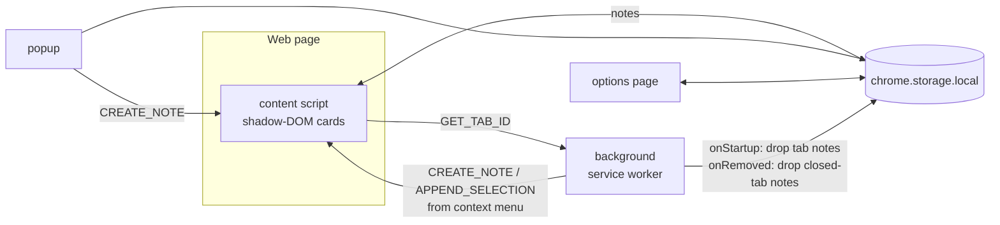
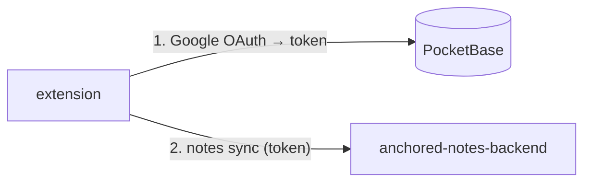

# Anchored Notes


A Chrome (Manifest V3) extension for leaving sticky notes on web pages. Each note
is **anchored** to one of four scopes and reappears wherever that scope matches.

| Scope    | Shows on                                            |
| -------- | --------------------------------------------------- |
| `global` | every open page                                     |
| `site`   | every page of the note's origin (e.g. `google.com`) |
| `page`   | the exact URL (origin + path + query, hash ignored) |
| `tab`    | that tab, even after navigation; lost on restart    |

Notes are draggable, resizable, recolorable (7 colors), and the scope can be
changed at any time from the dropdown on the note header. When the page exposes a
PWA `manifest.json` with `short_name` or `name`, the **Site** scope option shows
that app name; otherwise it falls back to the short domain (e.g. `bbc.com` from
`www.bbc.com`). The **Page** scope shows the current `document.title` when available.
[Milkdown](https://github.com/Milkdown/milkdown) markdown WYSIWYG editor
(commonmark + GFM presets, themeless), so `note.content` is stored as markdown
text — backward compatible with earlier plaintext notes. It supports a
Notion-style `/` slash menu for inserting blocks (headings, lists, task lists,
quote, code, tables, divider), GFM task lists with clickable checkboxes, and
resizable tables with a floating toolbar (add/remove rows and columns, delete
table). Markdown-aware paste parses pasted markdown into formatted content
rather than keeping it as raw text.

## Architecture


```mermaid
flowchart LR
  subgraph page[Web page]
    CS[content script\nshadow-DOM cards]
  end
  POP[popup] -->|CREATE_NOTE| CS
  BG[background\nservice worker] -->|CREATE_NOTE / APPEND_SELECTION\nfrom context menu| CS
  CS -->|GET_TAB_ID| BG
  CS <-->|notes| ST[(chrome.storage.local)]
  POP --> ST
  OPT[options page] <--> ST
  BG -->|onStartup: drop tab notes\nonRemoved: drop closed-tab notes| ST
```

- **Storage:** all notes live under one `notes` key in `chrome.storage.local`.
  Tab-scoped notes are dropped on `onStartup` (previous tab ids are meaningless)
  and on tab close, making them effectively session-only.
- **Visibility** is decided by the pure `isNoteVisible` function in
  `src/matching.ts`, shared by the content script, popup and options page.
- **Localization:** `src/i18n.ts` is a small runtime i18n layer supporting 16
  languages (English, Turkish, Spanish, German, Japanese, French, Portuguese,
  Russian, Italian, Dutch, Polish, Chinese, Persian, Arabic, Vietnamese, Korean).
  The active language is stored under the `lang` key in `chrome.storage.local`,
  defaulting to the detected system language. Switching it from the popup or
  options flag picker updates every context live (popup, options, on-page note cards,
  slash/table menus and the context menu) via a storage change listener.
  Per-language strings live in `src/locales/<lang>.ts`; English is canonical and
  its keys define the `MessageKey` type, so any missing translation is a
  compile-time error.

### Accounts, tiers & sync

Notes work fully offline without an account. Signing in (Google OAuth via
PocketBase) syncs notes across devices. The extension authenticates against
PocketBase and sends all note sync through the Go backend
([anchored-notes-backend](../anchored-notes-backend)). How the backend stores
notes and enforces limits is documented in that repo; this section covers only
the **client behavior and the API the extension calls**.


```mermaid
flowchart LR
  EXT[extension] -- "1. Google OAuth → token" --> PB[(PocketBase)]
  EXT -- "2. notes sync (token)" --> BE[anchored-notes-backend]
```

| Tier | Note limit | Sync |
|------|-----------|------|
| no account | 15 (one device) | none |
| free | 30 | across devices |
| pro | unlimited | across devices |

Client modules:

- **Limit** — `src/limits.ts` is the single source of truth. `getCurrentLimit`
  resolves the cap from the signed-in plan (anonymous = 15, free = 30, pro = ∞);
  all enforcement points (content script, popup, options) read from it.
- **Auth** — `src/auth.ts` runs the OAuth2 authorization-code flow via
  `chrome.identity.launchWebAuthFlow` and stores `{ token, email, plan }` under
  the `auth` key in `chrome.storage.local`. The flow runs in the **background
  worker** (`LOGIN` message) because opening the auth window closes the popup.
  `deleteAccount` calls the backend `DELETE /api/account` to hard-delete the
  account and all synced notes, then signs out and wipes local notes
  (`wipeLocalNotes`). The options page exposes sign-in, sign-out and a
  type-your-email-to-confirm **Delete account** action.
  PocketBase tokens expire (~7 days), so two mechanisms keep an actively used
  device signed in across that boundary: `refreshIfExpiringSoon` runs on the
  5-minute sync alarm (`src/background.ts`) and proactively renews the token
  once it's within 30 minutes of its `exp` claim, and `authFetch` — the
  authenticated-fetch helper every backend call goes through (sync, encryption
  endpoints, account deletion, billing) — refreshes once and retries on a 401.
  The realtime subscribe POST (`src/realtime.ts`) talks to PocketBase directly
  rather than through `authFetch`, and applies the same refresh-once-and-retry
  rule itself; when it does give up it reports the closure so the content
  script drops its handle and reconnects on the next auth change instead of
  holding a dead one — never for a connection the caller already disconnected,
  which would clear the handle on the newer connection that replaced it. Only a
  401 that survives that retry is treated as a genuinely dead session. A refresh
  replaces the token and nothing else: `plan` and `email` stay under the stored
  state's control (`sync` is the authority on plan changes), so a refresh can
  never downgrade a pro account, and it is discarded outright if the stored
  token changed while it was in flight (a sign-out or an account switch), so it
  can never attach one account's token to another's state. A device left
  offline past `exp` can't be rescued by either path and is signed out on its
  next sync.
- **Sync** — `src/sync.ts` runs only in the background worker (single context, no
  cross-context races). It pushes local non-`tab` notes plus tombstoned deletions
  (`deletedNoteIds` in `src/storage.ts`) and merges the response into local
  storage atomically (last-write-wins on `updatedAt`). Triggers: note changes
  (debounced), sign-in, a 5-minute alarm, and realtime events. `tab`-scoped notes
  are session-only and never sync; switching an already-synced note to `tab`
  scope tombstones it so the next sync deletes the server copy, while the note
  lives on locally (`applySyncResult` keeps `tab` notes through applied deletes).
  The note card shows a small notice on `tab`-scoped notes that they aren't
  synced or saved and vanish at session end.
- **Encryption** — note `content` is encrypted at the sync boundary
  (`src/sync.ts` encrypts on push, decrypts on pull); local storage stays
  plaintext so search/titles/export are unaffected. `src/crypto.ts` holds the
  primitives (PBKDF2-SHA256 600k iters → AES-256-GCM, random IV per encryption,
  wire format `enc:v1:<base64(iv || ciphertext)>`); `src/encryption.ts` holds the
  key lifecycle. Every signed-in account is encrypted: without a custom password
  the key derives from the PocketBase user id (zero-friction encryption at
  rest); setting a password in the options page upgrades to true end-to-end
  encryption — losing that password makes synced notes unrecoverable, and the
  UI warns so. The account's salt + verifier (`encSalt`/`encCheck`) live on the
  backend; a device whose key stops matching (password changed elsewhere) gets
  a `409` from sync, wipes its key, and shows a "password required" unlock in
  the popup/options until the new password is entered. Legacy plaintext pulled
  from the server is accepted and self-heals: the note's `updatedAt` is bumped
  to the server timestamp + 1 so the follow-up sync re-pushes it encrypted.
  The derived key persists in `chrome.storage.local` and is wiped on
  sign-out/account deletion.
- **Realtime** — `src/realtime.ts` subscribes to PocketBase's SSE realtime for the
  signed-in user's own notes, so changes from other devices appear live instead of
  waiting for the alarm. The content script connects while the tab is **visible
  and signed in** (and disconnects otherwise); a realtime event just triggers a
  background sync (the single reconciliation path), which updates storage and
  re-renders every context.
- **Config** — `src/config.ts` hardcodes only the backend URL; the PocketBase
  URL and OAuth provider name are fetched at runtime from the backend's
  `/api/config` (cached per session). Loading the extension requires the
  `identity` permission and a Google OAuth provider configured in PocketBase.

#### API the extension calls

**Authentication — PocketBase** (`src/auth.ts`), standard OAuth2 code flow:

| Method | Endpoint | Purpose |
|--------|----------|---------|
| GET | `…/api/collections/users/auth-methods` | get the Google provider `authURL`, `state`, `codeVerifier` |
| POST | `…/api/collections/users/auth-with-oauth2` | exchange `{ provider, code, codeVerifier, redirectUrl }` → `{ token, record }` |
| POST | `…/api/collections/users/auth-refresh` | `Authorization: Bearer <token>` → fresh `{ token, record }`; only `token` is adopted (see `refreshAuthToken`) |

The extension's OAuth `redirectUrl` is `chrome.identity.getRedirectURL()`
(`https://<extension-id>.chromiumapp.org/`) and must be registered in the Google
OAuth client's authorized redirect URIs.

**Sync — backend** (`src/sync.ts`), `Authorization: Bearer <PocketBase token>`:

`POST /api/notes/sync`

```jsonc
// request
{
  "upserts":  [ /* Note in wire format (below), content encrypted */ ],
  "deletes":  [ "clientId", … ],          // tombstoned local deletions
  "encCheck": "enc:v1:…"                  // this device's key verifier; 409 if stale
}
// response — authoritative set after reconciliation
{
  "notes":    [ /* Note[], incl. deleted=true tombstones */ ],
  "rejected": [ "clientId", … ],          // would exceed the plan limit
  "failed":   [ "clientId", … ],          // backend rejected (e.g. content too long)
  "plan":     "free" | "pro",
  "limit":    30,                         // -1 = unlimited
  "encCheck": "enc:v1:…"                  // account's current key verifier
}
```

Deletes are soft: the client sends deleted `clientId`s in `deletes`, and the
backend returns them as `deleted=true` tombstones. The client drops tombstoned
notes locally (and never resurrects a note another device deleted). `rejected`
and `failed` notes are kept local-only so nothing is lost. The wire
format maps the local `Note` fields: `id → clientId`, `createdAt → noteCreatedAt`,
`updatedAt → noteUpdatedAt`; `content` is encrypted in transit (see
**Encryption** above); all other fields (`color`, `scope`, `anchorKey`,
`x/y/w/h`, `hidden`) are sent as-is.

**Realtime — PocketBase** (`src/realtime.ts`): open an `EventSource` to
`…/api/realtime`, read the `clientId` from the `PB_CONNECT` event, then `POST`
`{ clientId, subscriptions: ["notes/*"] }` with `Authorization: <token>`. Events
arrive as `{ action, record }`; the owner-only `listRule` scopes them to the
user's own notes. `EventSource` auto-reconnects (re-subscribe on each
`PB_CONNECT`).

**Encryption state — backend** (`src/encryption.ts`): `GET /api/me` returns
`{ id, encSalt, encCheck, … }` used to derive/verify the device key, and
`PUT /api/me/encryption` stores a new `{ encSalt, encCheck }` with a
compare-and-swap on `expectedEncCheck` (409 = changed on another device).

> The backend also exposes `GET /api/notes`; the extension does not use it. See
> [anchored-notes-backend](../anchored-notes-backend) for the full API
> reference and the backend's internals.

### Analytics (Umami)

Product usage is measured with Umami's HTTP collect API (`src/umami.ts`) — no
third-party script tag, so it stays compatible with extension CSP / Chrome
policies. Set `UMAMI_URL` and `UMAMI_WEBSITE_ID` in `src/config.ts` (either empty
disables tracking). Every event includes `anonymousIdentifier` (a locally
generated UUID stored under `anonymousIdentifier` in `chrome.storage.local` —
never email or other account PII), `noteCount`, `plan`, and a `ts` timestamp;
note content and page URLs are never sent.

| Priority | Events |
| -------- | ------ |
| MVP | `note_created`, `note_deleted`, `note_scope_changed`, `note_edited` (first edit per 30 min session window), `selection_appended`, `sign_in_started` / `sign_in_succeeded` / `sign_in_failed`, `upgrade_clicked`, `note_limit_hit`, `popup_opened` |
| Medium | `note_hidden`, `note_restored`, `note_color_changed`, `notes_exported`, `notes_imported`, `enc_password_set`, `enc_unlocked`, `enc_unlock_failed`, `enc_password_required_shown` (once per browser session), plus one event per slash command (`slash_text`, `slash_heading1`, …) and table toolbar action (`table_add_column`, …) |
| Navigation & account | `popup_open_options` (`from`: `manage_all_notes` \| `account_email` \| `enc_warning`), `options_opened`, `sign_out`, `billing_opened`, `account_deleted`, `lang_changed`, `options_search_used` (once per options page load when query becomes non-empty), `options_note_previewed`, `options_anchor_opened`, `badge_opened`, `popup_restricted_page_warning` |

`note_created.source` is `popup`, `context_menu`, or `append_fallback`.

## Develop

```bash
npm install
npm run build      # generates icons + _locales + bundles into dist/
npm test           # unit tests for matching logic
npm run typecheck
npm run package    # builds, then zips dist/ into anchored-notes-<version>.zip
```

Pushes to `main` also run `.github/workflows/package.yml`, which packages the
extension and uploads `anchored-notes-<version>.zip` as a workflow artifact.

Then load `dist/` via `chrome://extensions` → Developer mode → **Load unpacked**.

On first install (`reason === "install"`), the background worker opens the
backend `/welcome` page in a new tab, with `?lang=<current UI language>` so the
onboarding page matches the extension's language. It's a normal https page the
content script matches, so the user creates their first note there instead of
first attempting it on restricted pages (the Web Store or the New Tab page) and
mistaking the restriction for a broken extension. Updates don't open the tab.

The store-facing extension name and description are localized through
`_locales/<chrome-locale>/messages.json` (generated by `mklocales.mjs`,
referenced from `manifest.json` via `__MSG_extName__` / `__MSG_extDesc__`),
separate from the runtime UI i18n in `src/locales/`. Icons are rendered at 16,
48 and 128 px by `mkicons.mjs`. SPA route changes (history `pushState` /
`replaceState`) are picked up via the Navigation API so page-scoped notes
re-evaluate without a full reload.

## Usage

- Right-click a page → **Add Note Here**, or click the toolbar icon → **Add note
  to this page**. With text selected and a note focused, right-click → **Add
  selection to the note** to append the selection as a markdown blockquote.
- Drag by the header, resize from the bottom-right corner, pick a color with the
  🎨 button, change the anchor scope with the dropdown. The ⋮ button opens an
  options menu to **Hide** or **Delete** the note.
- Hiding collapses a note into a badge in the bottom-right corner of the page
  showing the count of hidden notes; click the badge to pick one and restore it.
  The badge stays out of sight while no note on the page is hidden.
- Manage, search, export and import all notes from the options page. Each row
  shows the note's auto-derived title (its first markdown block); click a row to
  expand a rendered markdown preview of the full content inline.
- Switch the interface language from the small flag button in the top-right of
  the popup or options page (16 languages supported). The default follows your
  system language.
