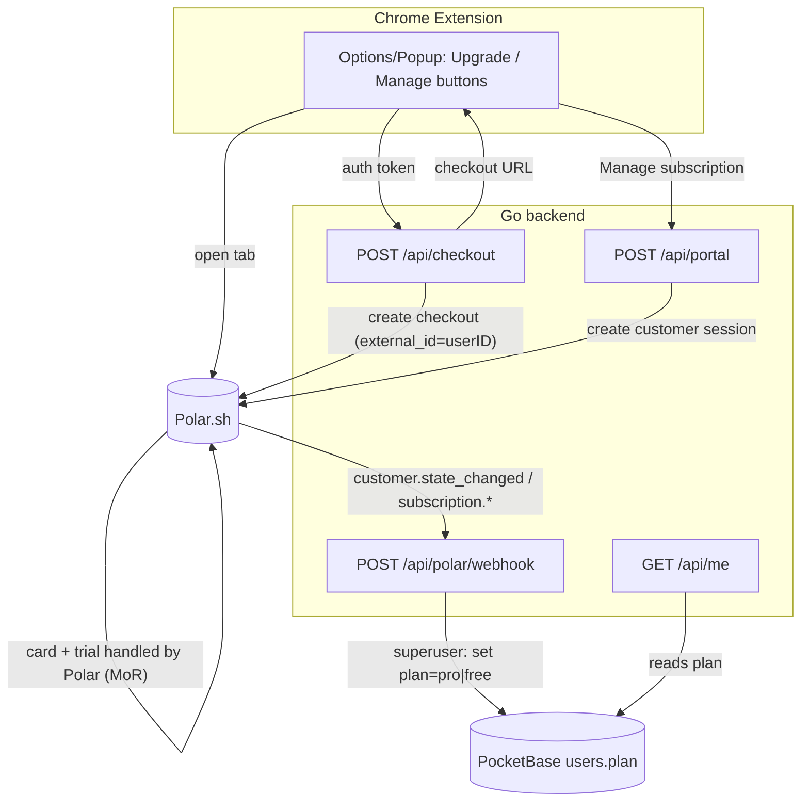
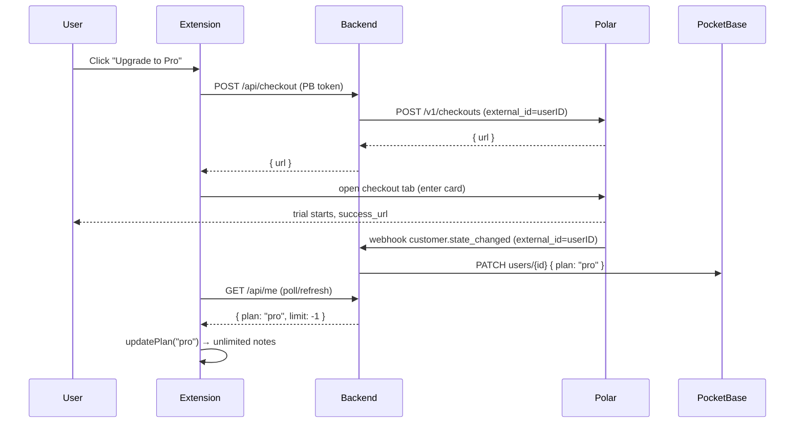

# Polar.sh Integration Plan — Anchored Notes

Plan for adding paid **Pro** subscriptions ($5/mo, 1‑month free trial) to Anchored
Notes using [Polar.sh](https://polar.sh) as the **Merchant of Record** (MoR). Polar
handles checkout, cards, global sales tax/VAT, the free trial, dunning, and the
customer self‑service portal; our only job is to **map a Polar subscription back to
the `users.plan` field** that the backend already enforces.

> Verified against Polar docs (API version `2026-04`) on 2026‑06‑30:
> [Customer State](https://polar.sh/docs/integrate/customer-state),
> [Webhook events](https://polar.sh/docs/integrate/webhooks/events),
> [Webhook endpoints / signing](https://polar.sh/docs/integrate/webhooks/endpoints),
> [Create Checkout Session](https://docs.polar.sh/api-reference/checkouts/create-session),
> [Customer Portal](https://polar.sh/docs/features/customer-portal),
> [Trials](https://polar.sh/features/trials).

---

## 1. Current state (what we already have)

| Layer | Today |
| ----- | ----- |
| Auth | Google OAuth2 **direct to PocketBase** (`src/auth.ts` → `auth-with-oauth2`). No password auth. |
| Plan source of truth | `users.plan` select field on PocketBase (`free` \| `pro`, empty = free). |
| Enforcement | Go backend reads `user.plan`, applies note limits (`limits.go`: free 20, pro unlimited) on every sync write. |
| Plan surfaced to client | `GET /api/me` → `{ email, plan, limit, count }`; `src/auth.ts` caches plan in `chrome.storage.local`. |
| Upgrade path | **None.** README: "Set `pro` manually from the PocketBase admin UI; payment integration is out of scope for now." |

**Key insight:** the integration is small. `plan` already gates everything. We only
need a system that flips `plan` to `pro` when a Pro subscription is active and back to
`free` when it is revoked. Polar webhooks do exactly that.

### Tiers (unchanged)

| Plan | Note limit | Polar product |
| ---- | ---------- | ------------- |
| anonymous (no account) | 10 (client‑side only) | — (never touches Polar) |
| free (signed in) | 20 | Free product (nominal — see §3) |
| pro | unlimited | Pro product, $5/mo, 1‑mo trial |

---

## 2. Target architecture



**Linking strategy (the crux):** set Polar's **`customer_external_id` = PocketBase
user ID** when creating the checkout. Polar then attaches the subscription to that
external id, and every webhook carries it back — so the backend maps an event to a
user with **zero extra storage**, no email matching, no new DB columns. Email is
mutable/duplicable; the PB user id is stable and already the relation key for notes.

---

## 3. Polar dashboard setup (one‑time, do in Sandbox first)

Sandbox (`https://sandbox.polar.sh`) is a fully separate environment with test cards.
Build and verify the whole flow there before flipping a single env var to production.

1. **Organization** → create one; generate an **Organization Access Token** (this is
   `POLAR_ACCESS_TOKEN`).
2. **Products**
   - **Pro** — recurring, **$5/month**. Enable **trial period = 1 month**. Attach a
     benefit **"Pro access"** (custom benefit; we don't use Polar's file/license/Discord
     grants — the benefit is just a flag the webhook reads). Note its **product id** →
     `POLAR_PRO_PRODUCT_ID`.
   - **Free** — $0 recurring with a **"Free access"** benefit.
     **Recommendation:** keep the Free product *nominal*. Do **not** force every Google
     signup through a Polar free checkout — that adds a redirect and a failure point to
     login for zero benefit. In our model, *being signed in = free* and `plan` defaults
     to free in PocketBase. The Free Polar product exists only for catalog completeness
     / future use. Gating stays: `plan == "pro"` ⇒ pro, everything else ⇒ free.
3. **Webhook endpoint** → URL `https://anchored-notes.puhulab.com/api/polar/webhook`,
   format **Raw** (Standard Webhooks). Subscribe to: `customer.state_changed`,
   `subscription.active`, `subscription.revoked` (and optionally `subscription.canceled`
   for analytics). Copy the **signing secret** → `POLAR_WEBHOOK_SECRET`.
4. (Optional) **Trial abuse prevention** toggle on the Pro product — Polar matches new
   checkouts against past trial redemptions by normalized email + card fingerprint. Free
   to enable, no code.

> Why `customer.state_changed` is the primary event: it carries the customer's **full
> current state** (active subscriptions + granted benefits) in one payload, so handling
> it is **order‑independent and idempotent** — we just overwrite `plan` from the latest
> truth. The individual `subscription.active`/`revoked` events are a belt‑and‑suspenders
> backup. We do **not** try to reconstruct state from event ordering.

---

## 4. Backend changes (`~/Projects/anchored-notes-backend`)

Style note: the repo deliberately avoids heavy deps (hand‑rolled `pb/client.go`, static
binary on `scratch`). Two valid options:

- **A — plain REST** (recommended, matches existing style): a tiny `polar/client.go`
  doing `POST /v1/checkouts`, `POST /v1/customer-sessions`, and HMAC‑SHA256 verification.
  Keeps the scratch image dependency‑free.
- **B — official Go SDK** [`polar-go`](https://github.com/polarsource/polar-sdks): less
  code, more deps. Fine, but heavier than the current footprint.

This plan assumes **A**.

### 4.1 New config (`config.go` + `.env.example`)

| Var | Required | Description |
| --- | -------- | ----------- |
| `POLAR_ACCESS_TOKEN` | yes | Organization access token (Bearer for Polar API). Secret. |
| `POLAR_WEBHOOK_SECRET` | yes | Standard‑Webhooks signing secret (`whsec_…`). Secret. |
| `POLAR_PRO_PRODUCT_ID` | yes | Pro product id to check out. |
| `POLAR_SERVER` | no | `sandbox` \| `production` (default `sandbox`). Selects `https://sandbox-api.polar.sh` vs `https://api.polar.sh`. |
| `POLAR_SUCCESS_URL` | no | Where Polar redirects after checkout. Default a static backend page e.g. `https://anchored-notes.puhulab.com/upgrade-success`. |

Add validation to `loadConfig` (explicit error on missing, same as existing vars).

### 4.2 `polar/client.go` (new)

Thin connector (OOP class is acceptable here per house style — it's an external‑system
interface). Methods:

```go
// CreateCheckout starts a Pro checkout bound to our user.
//   POST {base}/v1/checkouts
//   body: { products:[POLAR_PRO_PRODUCT_ID], customer_external_id: userID,
//           customer_email: email, success_url: POLAR_SUCCESS_URL,
//           metadata: { userId: userID } }
//   → returns the checkout `url`.
func (c *Client) CreateCheckout(ctx, userID, email string) (string, error)

// CreateCustomerSession opens the self-service portal for an existing customer.
//   POST {base}/v1/customer-sessions  body: { customer_external_id: userID }
//   → returns `customer_portal_url`.
func (c *Client) CreateCustomerSession(ctx, userID string) (string, error)

// VerifyWebhook checks the Standard-Webhooks signature over the raw body.
func VerifyWebhook(secret string, headers http.Header, body []byte) error
```

`customer_external_id` semantics (verified): if a customer with that external id exists
the subscription links to it; otherwise Polar creates the customer with that external id.
So the **first** checkout self‑registers the mapping — no pre‑provisioning needed.

### 4.3 New routes (`main.go`)

```go
mux.HandleFunc("POST /api/checkout",      authMiddleware(client, server.handleCheckout))
mux.HandleFunc("POST /api/portal",        authMiddleware(client, server.handlePortal))
mux.HandleFunc("POST /api/polar/webhook", server.handlePolarWebhook) // NO authMiddleware
```

- **`handleCheckout`** — `user := userFromContext`; `url := polar.CreateCheckout(ctx,
  user.ID, user.Email)`; respond `{ "url": url }`. The extension opens it.
- **`handlePortal`** — `url := polar.CreateCustomerSession(ctx, user.ID)`; respond
  `{ "url": url }`. (Returns an error if the user has never checked out — surface as
  "no subscription yet" in UI.)
- **`handlePolarWebhook`** — see §4.4.

CORS: `/api/checkout` and `/api/portal` are called from the extension, so they already
fit the existing `corsMiddleware`. The webhook is server‑to‑server (Polar → us), no CORS.

### 4.4 Webhook handler (the heart of it)

```
POST /api/polar/webhook
1. Read raw body (needed verbatim for signature).
2. polar.VerifyWebhook(secret, r.Header, body)  → 401 on mismatch.
   Standard Webhooks: headers webhook-id / webhook-timestamp / webhook-signature
   (svix-* aliases also sent). signature = base64(HMAC_SHA256(secret_bytes,
   "{id}.{timestamp}.{body}")). secret_bytes = base64decode(secret without "whsec_").
   Reject if timestamp skew > 5 min (replay guard).
3. Parse { type, data }.
4. Resolve userID:
     - customer.state_changed → data.external_id (the customer's external id)
     - subscription.*         → data.customer.external_id
   If empty/unknown → 200 + log (don't 500; avoids endless Polar retries on noise).
5. Decide plan:
     - customer.state_changed: plan = "pro" if ANY active_subscription has
       status in {active, trialing} for our Pro product (or any granted benefit),
       else "free".   ← single source, idempotent.
     - subscription.active  → "pro"
     - subscription.revoked → "free"
6. client.UpdateUserPlan(ctx, userID, plan)  // superuser PATCH users/{id} {plan}
7. 200 OK.
```

Notes:
- **Trial needs no special code.** A trialing subscription is *active* → `plan=pro`.
  When the trial ends unpaid, Polar emits `subscription.revoked` / a `state_changed`
  with no active sub → `plan=free`. We just trust the webhook.
- Add `pb.Client.UpdateUserPlan(ctx, id, plan)` (superuser `PATCH
  /api/collections/users/records/{id}` with `{"plan": "..."}`). Reuse the cached
  superuser token already used for note writes.
- **Idempotent & retry‑safe:** the handler only *sets* `plan` to a computed value, so
  duplicate deliveries are harmless. Always return 200 for handled (even if user
  unknown) so Polar stops retrying; return 5xx only on *our* transient failures (PB
  down) so Polar retries with backoff.

### 4.5 Optional self‑heal on `/api/me`

Webhooks are primary. As a safety net against a missed delivery, `handleMe` *may*
additionally call Polar **Get Customer State by External ID** and reconcile `plan`
before responding. Keep it **off by default** (extra latency + Polar call on every
`me`); enable only if we observe drift. Webhook‑driven is the robust default.

---

## 5. Frontend changes (`~/Projects/anchored-notes`)

Small, additive. The plan badge / `AuthState.plan` plumbing already exists
(`src/auth.ts`, `updatePlan`, `onAuthChanged`). New config constant: a `BACKEND_URL`
already exists in `src/config.ts`.

1. **`src/auth.ts`** — two thin calls:
   ```ts
   export async function startUpgrade(): Promise<void> {
     const auth = await getAuthState(); if (!auth) throw …;
     const res = await fetch(`${BACKEND_URL}/api/checkout`, {
       method: "POST", headers: { Authorization: `Bearer ${auth.token}` } });
     const { url } = await res.json();
     await chrome.tabs.create({ url });            // open Polar checkout
   }
   export async function openBilling(): Promise<void> {  // → /api/portal, same shape }
   ```
2. **Options page (`src/options`)** — in the existing account section:
   - free users: **"Upgrade to Pro — $5/mo, 1 month free"** → `startUpgrade()`.
   - pro users: **"Manage subscription"** → `openBilling()` (cancel/card/invoices live
     in Polar's portal — we build none of that).
3. **Plan refresh after checkout.** The webhook updates `plan` server‑side
   asynchronously; the local cache won't know yet. On the upgrade button and on
   popup/options focus, **re‑fetch `GET /api/me`** and call `updatePlan(plan)`. Simplest
   robust UX: after returning from the Polar tab, poll `/api/me` a few times (e.g. every
   3 s for ~30 s) or refresh on next `onAuthChanged`/visibility. No realtime needed.
4. **Popup** — optionally show a subtle "Upgrade" affordance for free users; reuse the
   same `startUpgrade()`.

No change to sync/limits logic — once `plan` is `pro`, the existing backend lifts the
limit automatically.

---

## 6. End‑to‑end flow



Cancellation / trial‑end mirror this: Polar → `subscription.revoked` /
`state_changed` → `plan=free` → next `/api/me` reflects free.

---

## 7. Implementation checklist

**Backend**
- [ ] `config.go` + `.env.example`: add `POLAR_*` vars with validation.
- [ ] `polar/client.go`: `CreateCheckout`, `CreateCustomerSession`, `VerifyWebhook` (Standard Webhooks HMAC).
- [ ] `pb/client.go`: `UpdateUserPlan(ctx, id, plan)` (superuser PATCH).
- [ ] `main.go`: routes `/api/checkout`, `/api/portal`, `/api/polar/webhook`.
- [ ] `handlePolarWebhook`: verify → resolve external_id → compute plan → update → 200.
- [ ] Tests: signature verify (good/bad/replay), state→plan mapping, unknown‑user no‑op.
- [ ] README: replace "set pro manually" with the Polar flow; add `POLAR_*` to the config table; new endpoints table rows.

**Polar dashboard (sandbox → prod)**
- [ ] Org + access token; Pro $5/mo product with 1‑mo trial + "Pro access" benefit; (nominal) Free product.
- [ ] Webhook endpoint + secret; subscribe `customer.state_changed`, `subscription.active`, `subscription.revoked`.

**Frontend**
- [ ] `src/auth.ts`: `startUpgrade()`, `openBilling()`.
- [ ] Options account section: Upgrade (free) / Manage (pro) buttons.
- [ ] Post‑checkout `/api/me` refresh → `updatePlan`.
- [ ] Locales: add the new button strings to `_locales` / `mklocales`.

**Verification (sandbox)**
- [ ] Test‑card checkout → webhook → `plan=pro` → unlimited sync.
- [ ] Cancel in portal → `revoked` → `plan=free` → limit re‑applies.
- [ ] Trial‑end (force via dashboard "end trial") → `plan=free`.
- [ ] Webhook signature rejection returns 401; replay (old timestamp) rejected.
- [ ] Flip `POLAR_SERVER=production` + prod token/secret/product id; smoke test once.

---

## 8. Risks & decisions

| Topic | Decision |
| ----- | -------- |
| Mapping user ↔ Polar | `customer_external_id = PB user id`. Stable, no new storage, no email matching. |
| Out‑of‑order webhooks | Use `customer.state_changed` (full state) as primary → idempotent overwrite. |
| Free product | Nominal only; signup never goes through Polar. `plan` defaults free in PB. |
| Trial logic | None in our code — trialing = active = pro; trust webhooks. |
| Secrets | `POLAR_ACCESS_TOKEN`, `POLAR_WEBHOOK_SECRET` in `.env` only (gitignored), like PB creds. |
| Dependency footprint | Hand‑rolled REST + HMAC to keep the scratch image dep‑free (SDK optional). |
| Refund / tax / dunning | Entirely Polar's responsibility (Merchant of Record). |
| Auth scope | Unchanged — Google‑only OAuth via PocketBase. Polar is billing‑only, not an auth provider here. |

---

### Sources
- [Polar — Customer State](https://polar.sh/docs/integrate/customer-state)
- [Polar — Webhook events](https://polar.sh/docs/integrate/webhooks/events)
- [Polar — Webhook endpoints & signing (Standard Webhooks)](https://polar.sh/docs/integrate/webhooks/endpoints)
- [Polar — Create Checkout Session](https://docs.polar.sh/api-reference/checkouts/create-session)
- [Polar — Create Customer Session](https://docs.polar.sh/api-reference/customer-portal/sessions/create)
- [Polar — Customer Portal](https://polar.sh/docs/features/customer-portal)
- [Polar — Trials](https://polar.sh/features/trials)
- [Polar — Products](https://docs.polar.sh/features/products)
