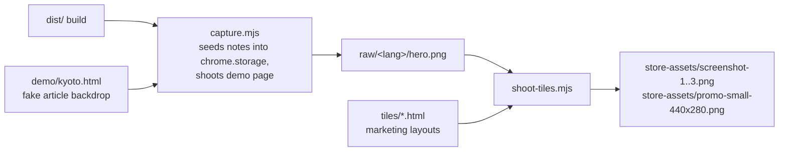

# Store asset generator

Regenerates the Chrome Web Store screenshots and promo tile from the **real
extension** running in Chrome for Testing. Use it whenever the note UI or the
marketing copy changes.

```bash
# from the repo root
npm run build                 # produces dist/ (the tiles shoot the real build)

cd store-assets/gen
npm install                   # puppeteer-core
npm run chrome                # one-time: downloads Chrome for Testing into ./chrome
npm run shoot                 # capture raws + render tiles + copy into store-assets/
```

`CHROME_PATH=/path/to/chrome npm run shoot` skips the bundled download and uses
that binary instead (must support `--load-extension`, i.e. Chrome for Testing or
Chromium — branded Chrome 137+ dropped the flag).

## Pipeline



- `i18n.mjs` — every localized string (16 languages): demo-page copy, seeded
  note markdown, tile headlines, plus per-script font pairings and text
  direction. Edit marketing copy here, not in the tile HTML.
- `capture.mjs` — serves `demo/kyoto.html` on `localhost:8123` (rendered per
  language), loads `dist/` as an unpacked extension, seeds three localized
  demo notes and the matching UI `lang` into `chrome.storage.local`, and
  screenshots the page at 1280×800 @2x into `raw/<lang>/`. RTL languages get
  mirrored note positions.
- `tiles/*.html` — the marketing compositions as `{{placeholder}}` templates:
  `tile1..3` (1280×800 screenshots), `promo` (440×280 small tile), `marquee`
  (1400×560 marquee tile); `base.css` holds the shared "editorial stationery"
  styling and the RTL overrides.
- `shoot-tiles.mjs` — renders every tile for every language at its exact CWS
  size (no alpha): English into `store-assets/`, the rest into
  `store-assets/<lang>/`.

Both scripts accept language codes as args to regenerate a subset, e.g.
`node capture.mjs tr ja && node shoot-tiles.mjs tr ja`.

Note positions in `capture.mjs` and the crop offsets in the tiles (tile1 /
marquee viewport, tile2 polaroid `.pcrop`) are pixel-tuned to the demo page
layout — if you edit `demo/kyoto.html` or the note sizes, eyeball
`raw/<lang>/hero.png` before re-rendering the tiles.
