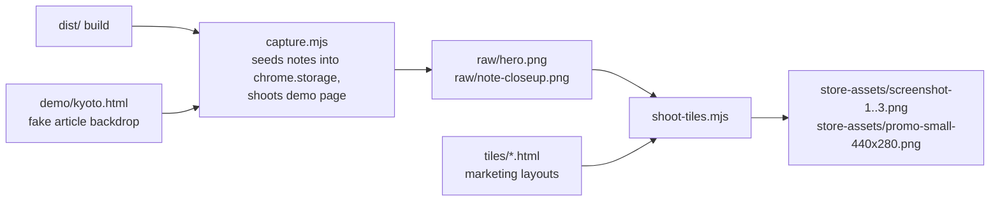

# Store asset generator

Regenerates the Chrome Web Store screenshots and promo tile from the **real
extension** running in Chrome for Testing. Use it whenever the note UI or the
marketing copy changes.

```bash
# from the repo root
npm run build                 # produces dist/ (the tiles shoot the real build)

cd store-assets/gen
npm install                   # puppeteer-core
npm run chrome                # one-time: downloads Chrome for Testing into ./chrome
npm run shoot                 # capture raws + render tiles + copy into store-assets/
```

`CHROME_PATH=/path/to/chrome npm run shoot` skips the bundled download and uses
that binary instead (must support `--load-extension`, i.e. Chrome for Testing or
Chromium — branded Chrome 137+ dropped the flag).

## Pipeline



- `capture.mjs` — serves `demo/kyoto.html` on `localhost:8123`, loads `dist/`
  as an unpacked extension, seeds three demo notes (page/site/global scopes)
  into `chrome.storage.local`, and screenshots the page at 1280×800 @2x.
- `tiles/*.html` — the marketing compositions: `tile1..3` (1280×800
  screenshots), `promo` (440×280 small tile), `marquee` (1400×560 marquee
  tile); `base.css` holds the shared "editorial stationery" styling. Headline
  copy lives in these files.
- `shoot-tiles.mjs` — renders each tile at its exact CWS size (no alpha) and
  copies the results up into `store-assets/`.

Note positions in `capture.mjs` and the clip rectangle for the close-up are
pixel-tuned to the demo page layout — if you edit `demo/kyoto.html` or the
note sizes, eyeball `raw/hero.png` before re-rendering the tiles.
