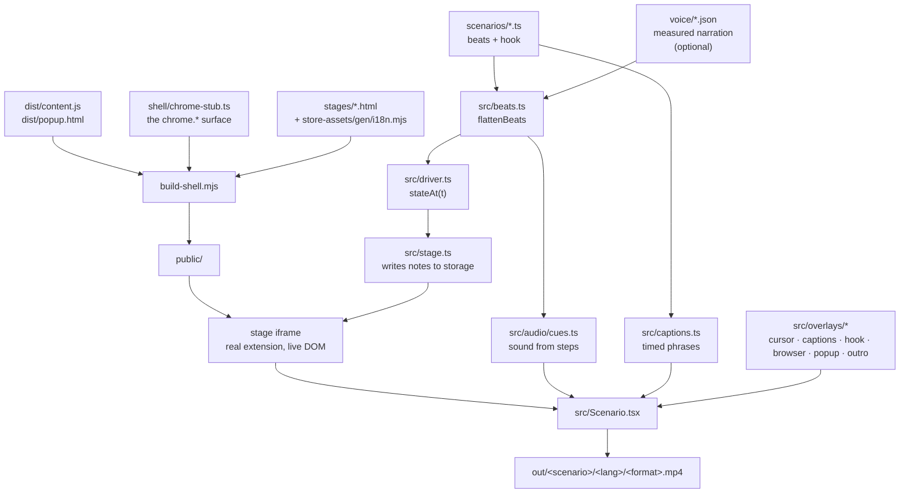

# Marketing video generator

Renders "someone using the extension" videos from the **real extension**, driven
by a scenario file. Sibling of `store-assets/gen/`, which does the same for the
Chrome Web Store stills.

```bash
# from the repo root
npm run build                 # produces dist/ (the videos run the real bundle)

cd video
npm install
node build-shell.mjs          # assembles public/
node render.mjs               # every scenario × language × format → out/
```

`npm run studio` opens Remotion Studio for scrubbing while you build a scenario;
`npm test` runs the chrome-stub smoke test; `node preview.mjs article ar` renders
a stage to PNG without booting Remotion.

Before rendering, three gates say whether the video is worth the wait:

```bash
npm run check-video     -- kyoto-basics tr 9-16   # hook, captions, camera, pacing
npm run sfx-check       -- kyoto-basics tr 9-16   # cue spacing, overlap, repeats
npm run audio-preflight -- kyoto-basics tr 9-16   # measured levels; exit 1 blocks
```

`check-video` walks the timeline through the real driver and the real camera
(`src/camera.ts`), so what it measures is what will be rendered. It refuses:

- a caption on screen for less time than it takes to read;
- a note parked where the extension's own clamp would move it;
- a passage selected while the page is blurred — an invisible selection;
- **the pointer leaving the frame**, which is a gesture nobody can attribute to
  anything, and is what a camera arriving somewhere the cursor is not looks
  like;
- a shot that changes by more than a fifth of the frame in a single frame —
  these videos are one continuous take, so a jump that size reads as a glitch
  rather than as a cut.

It prints the fastest camera move in every video, so the margin is visible
rather than merely unbreached.

## How it works

There is no screen recording and no mocked UI. The shipped `content.js` runs
inside a Remotion composition, against a stub of the browser APIs beneath it.



**Why this shape.** The content script barely touches `chrome.*` — seven
`chrome.runtime` calls, with storage isolated in `src/storage.ts` and
`src/i18n.ts` — so a small stub is enough to run it on an ordinary page. That
buys three things a screen recording cannot: the UI on screen is the shipped
build (it cannot drift from the product), zooms re-rasterise a live DOM instead
of upscaling pixels, and renders are reproducible.

## The pieces

- **`shell/chrome-stub.ts`** — `chrome.storage` (synchronous, so a write settles
  reconcile in the same tick), `chrome.runtime`, `chrome.tabs`, `chrome.i18n`.
  Also pins `Date.now`, `Math.random`, `crypto.randomUUID` and blocks the
  network: without that, relative timestamps drift and analytics fire mid-render.
  One `StubState` per session is shared by the stage and popup frames, so a
  popup action really reaches the content script.
- **`shell/stub.check.mjs`** — the load-bearing test. If the extension grows past
  what the stub implements, nothing else fails loudly; videos would just render
  an empty page. Run it after touching `src/content/`, `src/storage.ts` or
  `src/i18n.ts`. Named `.check` rather than `.test` on purpose: the repo root
  runs a bare `node --test`, which would otherwise pick this file up and fail on
  a fresh clone, where `video/node_modules` does not exist yet.
- **`stages/*.html`** — the pages notes get left on. Every site is invented; a
  stage shows the kind of page the extension is used on and never imitates a
  real company's product. `article` shares the copy deck in
  `store-assets/gen/i18n.mjs`, so it and the store screenshots describe the same
  fictional site in all 16 languages; `video-watch` and `profile` exist only for
  videos, so their words live in `copy/stages.ts` and they are built for the
  languages that deck names. Stage contract: 1280×800, no scrollbars, no
  page-level animation, no `<link rel="manifest">`, `shell.js` before the
  extension bundle, and the page background repeated on `<html>` (see the focus
  note below).
- **`sfx/`** — the sound library: 40 CC0 effects, each measured by ffmpeg into
  `manifest.json` (peak, attack, a mix-ready `defaultGain` targeting −14 dBFS).
  Committed, because `public/` is generated. `npm run sfx-fetch` adds more from
  Freesound; `npm run sfx-manifest` re-measures. The manifest's keys *are* the
  `SfxName` type, so a cue naming a sound that does not exist is a compile error.
- **`src/beats.ts`** — a scenario states beats, not steps. Each beat has a
  natural length from its own steps; if a narration has been recorded, the
  measured length of the spoken line wins and the steps inside scale to match.
  `flattenBeats` returns a plain `Step[]`, so the driver never learns that beats
  exist.
- **`src/audio/cues.ts`** — sound derived from the timeline. A step already says
  what is happening, so the step→sound table lives here rather than in every
  scenario, and gains are computed from the manifest against the narration's
  measured level. Nobody in this pipeline can hear the result, so nothing about
  it is estimated.
- **`src/driver.ts`** — `stateAt(t)` is pure and total: the scene is a function
  of the timeline alone. Remotion renders frames out of order and in parallel, so
  anything incremental would drift or tear.
- **`src/stage.ts`** — applies a scene by writing notes into stubbed storage,
  which is the extension's own update path (`storage.onChanged` → `reconcile` →
  cards mount, move, re-render). Only the badge list and a card's ⋮ menu — local
  UI state with no storage backing — are toggled directly.

## The videos

| Scenario | Stage | What it argues |
| --- | --- | --- |
| `kyoto-basics` | `article` | The whole loop: write, anchor, hide, find again. |
| `video-watch` | `video-watch` | A note that has to sit beside what you are watching. |
| `profile` | `profile` | A private reminder on a page that is not yours. |
| `ai-chat` | `ai-chat` | Keeping the two sentences worth keeping out of a long answer. |

Each renders into two formats, and says the same thing in both. The vertical cut
is not a crop of the wide one: it holds the establishing shot until the hook has
gone, pushes in harder afterwards, and parks its note where a phone-shaped frame
can still see it — so `build` takes the format, and the scenario decides what
changes.

## Adding a video

1. Write `scenarios/<id>.ts` and list it in `scenarios/index.ts`. A scenario owns
   its own strings — what it says is as particular to it as what it does, so its
   copy deck lives in its file. Only the closing tagline and the call to action
   are shared, in `copy/index.ts`.
2. If it needs a new backdrop, add `stages/<name>.html` (honour the contract
   above), its address in `STAGE_SITES` and its name in `STAGE_SITE_NAMES`
   (`stage-url.ts`), and its page copy in `copy/stages.ts`.
3. `npm run check-video -- <id> tr 9-16`, then `node render.mjs <id>`.

A scenario returns **beats**, each with an `id`, the line it says, and the steps
that fill it. The id is the contract with everything timed against it: captions,
and the narration if one is ever recorded.

Steps available inside a beat: `hold`, `cursor`, `click`, `createNote`, `type`,
`select`, `contextMenu`, `appendQuote`, `move`, `noteMenu`, `setHidden`,
`badgeList`, `popup`, `zoom`, `focus`, `sfx`, `parallel`, `outro`. Each runs for its `ms` and everything it changes is a
function of elapsed time.

`ai-chat` is the one that uses the browser's own furniture. A passage is
selected with `select`, and how much of it is highlighted is **whatever the
pointer is over**: the step says only that a drag is happening, and the range is
resolved from the cursor position against the real document, so the highlight
follows the pointer by construction. Revealing it on its own clock — the obvious
way to animate a selection — makes two animations of one gesture, and they drift
apart. `contextMenu` draws the menu the browser would draw, with
the two entries the extension registers, labelled from `src/locales/`. Clicking
the first turns the selection into a note; clicking the second appends it to the
existing one as a block quote, built the way `src/content/note-card.ts` builds
it. Nothing there is an effect: it is the product's real context-menu path.

The camera keeps its subject: whatever a `focus` step is holding sharp is kept
inside the shot, and the shot widens if a drag would otherwise carry it off an
edge. The correction is **weighted by the blur**, not switched on when the note
becomes the subject — a binary rule made the camera jump the frame focus handed
over from a note to the badge, because the widening it had been applying
vanished at once. A hidden note is never a subject: there is no card to keep in
view. An open context menu is framed by the scenario with an ordinary `zoom`,
for the same reason — it appears in one frame, and a shot that widened to catch
it would widen in one frame too.

`focus` names a subject — a note, the badge, or the popup — and everything else
blurs behind it. The subject is an element, not a rectangle, so a focused note
stays sharp through a drag with no geometry in the scenario, and handing over
from one subject to the next dissolves rather than cuts. The browser chrome is
never blurred: the address bar is what says this is a real browser.

`zoom` takes a rect in stage coordinates; `shot(centre, width, format)` builds
one, and the composition keeps it inside the window so pushing in near an edge
never exposes the backdrop. A shot is stated in stage pixels, not canvas pixels,
so a width means the same thing in every format.

The rect takes the **shape of the canvas**, which is what makes the two formats
behave. A wide frame gets the window's own proportions; a phone-shaped frame
gets a tall slice of the page, because a landscape window fitted into a portrait
canvas is a small band adrift in the middle.

Opening and resting are therefore two different shots (`stage-url.ts`):

- `initialView()` — where every video starts, always the whole window. A viewer
  has to be told once what they are looking at, and the address bar is what
  tells them; a page filling a phone screen could be anything. Vertical opens
  here and pushes in from it, which is what `scenarios/opening.ts` paces so the
  camera only starts moving once the hook has left.
- `homeView(format)` — where `rect: null` returns to mid-scene. Wide can rest on
  the whole window all day; vertical returns to the widest slice that still
  fills the frame, because going back to the full window between beats would
  leave the page small and adrift for most of the video.

Steps are sequential, so `parallel` is how a shot pushes in while the blur comes
up. Its children each run on their own `ms` inside its window — they start
together and may finish apart.

A `type` step also gives the note a text caret and turns the pointer into an
I-beam, for as long as it is running.

**Sound is not written, it is derived.** `cuesFrom(steps)` reads the step list
and places a click on a click, keystrokes through a `type`, friction under a
drag. A scenario adds an `sfx` step only for a moment the vocabulary cannot
express. Fades get no sound: `outro`, `focus` and `zoom` are silent, because a
fade has no acoustic counterpart.

**Captions come from the beats.** A beat carries the sentence it is about, and
`src/captions.ts` divides the beat between its phrases in proportion to their
length. `check-video` fails a line that is on screen for less time than it takes
to read — captions are the only voice a silent video has.

They sit in the **upper** part of the frame: on a feed the bottom strip belongs
to the platform's own title and buttons, and a line parked there is read late or
not at all. Three things outrank them for that space — the address bar (the
proof this is a real browser), the hook (the only thing worth reading in the
first seconds), and the popup, which hangs from the toolbar and covers the whole
upper right. Only the popup pushes the captions back down; under the hook they
slide up as it fades rather than jumping when it ends.

## Constraints worth knowing

- **Config rides in the URL hash, never the query.** A page-scoped note's
  `anchorKey` is origin + pathname + search (`src/matching.ts`), so query params
  would end up inside the note's identity and its header label.
- **Remotion serves `public/` under `/public/`**, the Node tools serve it at the
  root. Stages therefore reference `../shell.js` relatively, and the composition
  derives `assetBase` from `staticFile` rather than hardcoding a prefix.
- **The popup is remounted every frame while open**, because it reads storage as
  it boots — exactly like the real popup, which is rebuilt on each open.
- **Stages load webfonts from Google Fonts**, and `document.fonts.ready` is not
  enough on its own: it settles when nothing is *pending*, and a face nobody has
  asked for yet is not pending. A stylesheet that arrives late therefore leaves
  its faces unloaded, `ready` resolves at once, and the frame is captured in the
  fallback family. This really happened — two renders of `video-watch` differed
  in every frame, one in Fraunces and one in Georgia. `loadFonts` in
  `src/stage.ts` requests every declared face first, and a face that cannot be
  fetched fails the render instead of quietly substituting.
- **A focus step blurs elements, never a region.** `backdrop-filter` over the
  stage frame loses the frame's content wherever it is masked away, so a
  cut-out leaves the focus region blank instead of sharp. Instead `<body>` gets
  a plain `filter: blur()` — the extension mounts its shadow host on `<html>`
  (`src/content/index.ts` `mountHost`), so the product's UI is never caught by
  it — and the cards and the badge are blurred one by one. A stage must
  therefore repeat its page background on `<html>`, or the window's border
  lightens whenever the page steps back.
- **Narration is optional and not reproducible.** `npm run voiceover` calls a
  service that never returns the same bytes twice, so `voice/*.mp3` and the
  timeline beside it are **committed inputs to a render, not outputs of one**.
  With no timeline present a video is silent apart from its effects and its
  captions, which is the default; a timeline, once present, takes over the beat
  durations and the caption timing.
- **A selection is not an animation.** It is the consequence of where the
  pointer is. Both quoted sentences in `ai-chat` are kept to one line for the
  same reason: a wrapped sentence would send the pointer back to the left
  margin, which no hand does, and the highlight would jump between lines with
  it.
- **An unfocused document selects in grey.** Chrome paints a selection grey
  when the document is not focused, which a headless render never is. A stage
  that shows a selection states the active colour itself (`::selection` in
  `stages/ai-chat.html`), so the highlight looks the way it does for someone
  actually dragging through the sentence.
- **The extension moves a note that is parked past the edge.**
  `src/content/note-card.ts` clamps every card into the viewport, so a scenario
  that parks one outside gets a card somewhere other than where it asked, and
  every later step aiming at that card misses — hundreds of frames into a render,
  as "no card found at…". `check-video` refuses the scenario instead.
- **Sound is placed on frames, and frames are coarse.** A cue's start is
  computed in milliseconds — peak minus the sound's measured attack — and then
  floored, never rounded. Rounding splits the error either way and drops a
  sub-frame attack entirely (a 14 ms one is 0.42 of a frame), which left every
  short sound up to 30 ms late. The ear forgives early far more readily than
  late, so the bias is deliberate — and `audio-preflight` quantises the same way,
  because a gate that measures the unquantised ideal agrees with the cue table
  and disagrees with the render.
- **The typing caret is measured, not computed.** Only layout knows where a line
  wrapped or how tall a line box ended up, so `src/stage.ts` reads the last
  character's rect and places a caret element on the shadow root — after
  reconcile has run, so nothing the extension does can drop it.
  If that ever becomes flaky, vendor the fonts into `public/`.
