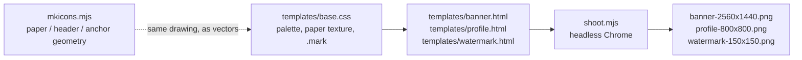

# YouTube channel branding

The channel art and channel metadata for the Anchored Notes YouTube channel —
where the videos rendered by [`../video/`](../video/README.md) are published.
Sibling of [`../store-assets/`](../store-assets/listing.md), which does the same
job for the Chrome Web Store.

| File | Slot | Spec | Actual |
| ---- | ---- | ---- | ------ |
| `banner-2560x1440.png` | Banner image | ≥ 2048×1152, ≤ 6 MB | 2560×1440, ~1.1 MB |
| `profile-800x800.png` | Profile picture | ≥ 98×98, cropped to a circle | 800×800, ~215 KB |
| `watermark-150x150.png` | Video watermark | 150×150, ≤ 1 MB, transparent | 150×150, ~4.5 KB |
| `channel-description.txt` | Channel → Basic info → Description | ≤ 1000 characters | 969 |
| `channel-keywords.txt` | Channel → Advanced settings → Keywords | ≤ 500 characters | 313 |

Upload the images under **Customization → Branding**, the two text files under
**Customization → Basic info** and **Settings → Channel → Advanced settings**.
The description ends with a `[add listing URL]` placeholder — replace it with
the real Chrome Web Store link before pasting.

## Regenerating

```bash
cd youtube-assets/gen
npm install          # puppeteer-core
npm run shoot        # renders all three PNGs into youtube-assets/
```

`CHROME_PATH=/path/to/chrome npm run shoot` overrides binary discovery. Unlike
`store-assets/gen`, nothing here loads an unpacked extension, so branded Chrome
works and no Chrome for Testing download is needed.



- `templates/base.css` — the same "editorial stationery" palette and paper
  texture as `store-assets/gen/tiles/base.css`, plus `.mark`: the extension
  icon's note-and-anchor redrawn as SVG. Its radius, header height and anchor
  transform mirror `mkicons.mjs`, and the `8 8 112 112` viewBox reproduces that
  file's `MARGIN`, so the channel mark and the toolbar icon are one drawing at
  any size. **If the icon geometry changes in `mkicons.mjs`, change it here too.**
- `templates/banner.html` — 2560×1440. Everything readable lives in `.safe`,
  the 1546×423 box YouTube keeps on every device; the loose notes outside it
  only appear on wider layouts, so nothing is lost when the banner is cropped
  to a phone.
- `templates/profile.html` — 800×800, the mark on paper. The mark is 520 px so
  it clears the circular crop with room to spare and still reads at 98 px.
- `templates/watermark.html` — 150×150 on a transparent ground, with a cream
  rim and a shadow so the mark holds its edge over any footage.
- `shoot.mjs` — renders each template at its exact size and fails if a file
  lands over YouTube's byte limit for its slot.
